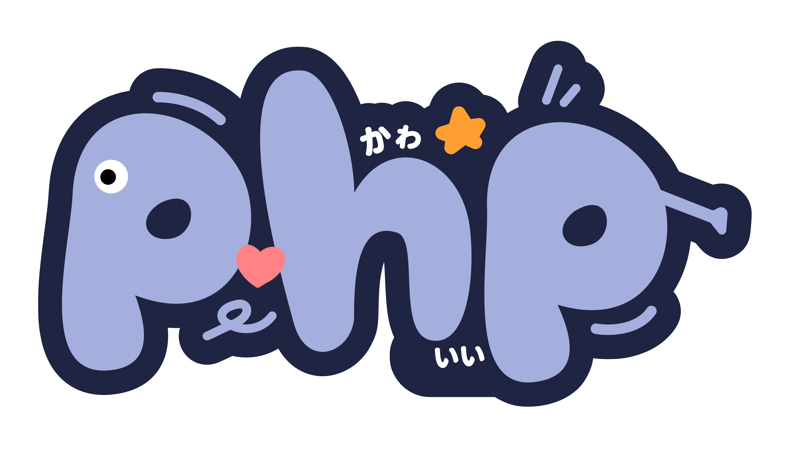

# Memulai Pemrograman PHP

Selamat datang di kelas memulai pemrograman PHP. Pada kelas ini kita akan belajar tentang Fundamental PHP. Adapun daftar materi yang akan kita pelajari sebagai berikut:

## Pengenalan PHP

1. [Apa Itu Pemrograman?](materi/001/apa-itu-pemrograman.md)
2. [Scripting dan Compiled Language](materi/002/scripting-dan-compiled.md)
3. [Apa Itu PHP?](materi/003/apa-itu-php.md)
4. Fitur pada PHP
5. Installasi PHP
6. Program Pertama PHP

## Komentar, Variable, Tipe Data, Input, dan Operator

1. Komentar pada PHP
2. Variable pada PHP
3. [Tipe Data pada PHP](materi/009/tipe-data.md)
4. [Input pada PHP](materi/010/input.md)
5. [Operator pada PHP](materi/011/operator.md)

## Flow Controls (Percabangan) pada PHP

1. if Statement
2. if...else Statement
3. Elseif Statement
4. Percabangan Bersarang
5. Switch...Case Statement

## Loops (Perulangan) pada PHP

1. Perulangan for
2. Perulangan while
3. Perulangan do...while

## Array pada PHP

1. Pengenalan Array
2. Array Terindex
3. Array Assosiatif
4. Membuat Array
5. Mengakses nilai Array
6. Menghapus nilai Array
7. Mengubah nilai Array
8. Array Multidimensi

## Function pada PHP

1. Function Bawaan PHP
2. Function yang ditentukan pengguna
3. Membuat Function
4. Memanggil Function
5. Argumen pada Function
6. Function PHP Mengembailkan Nilai
