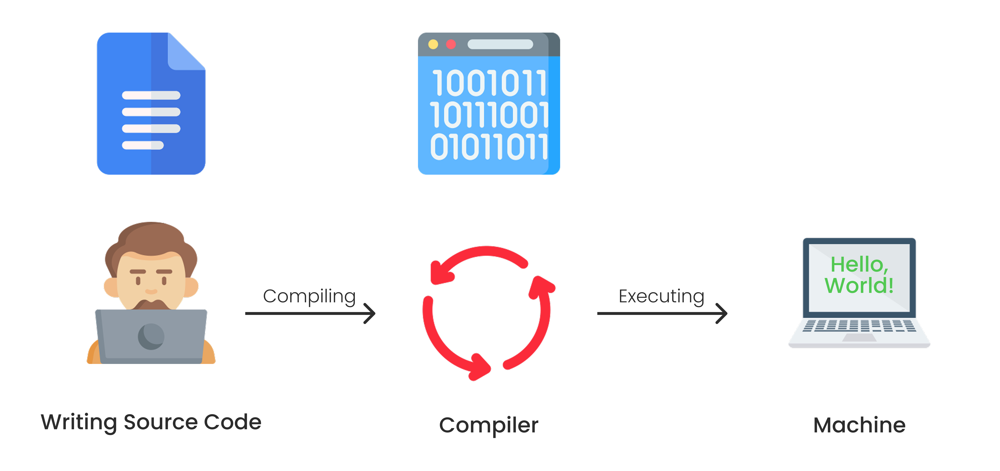
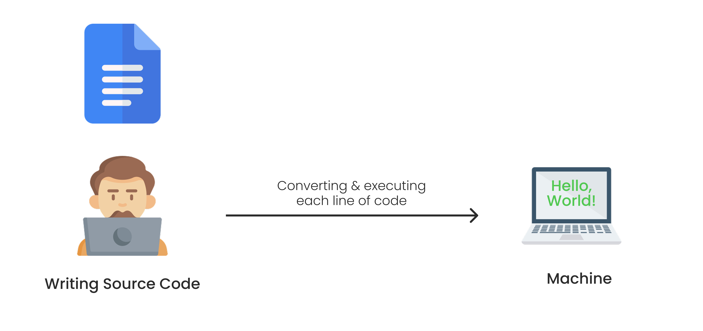

# Scripting dan Compiled Language

Pada dasarnya, pemrograman memungkinkan komputer menjalankan perintah-perintah sistematis dalam bahasa yang dimengerti. Sebagai pemrogram atau developer, kita perlu menggunakan bahasa yang tepat dan nantinya dapat dimengerti oleh komputer.

Serangkaian perintah komputer ditulis oleh developer dalam bentuk kode. Kode dapat berupa sekumpulan karakter, angka, dan simbol. Kode-kode ini hanya dipahami oleh manusia atau disebut dengan bahasa tingkat tinggi. Ada beragam bahasa pemrograman diluar sana dan memiliki penulisan kode atau sintaksis yang bermacam-macam. Beberapa contohnya adalah PHP, Javascript, Python, Kotlin, dsb.

Hasil kegiatan menulis kode ini disebut sebagai _source code._ Berikutnya, source code tersebut akan diubah ke bahasa yang dapat dipahami oleh komputer sehingga bisa dianalisis dan dieksekusi perintah-perintahnya. Inilah yang disebut dengan bahasa mesin. Bahasa ini sangat sulit dipahami oleh manusia dan hanya komputer yang memahami bahasa ini.

Bahasa mesin juga disebut sebagai bahasa tingkat rendah _(low-level language)_ disebut demikian karena dapat dieksekusi langsung oleh mesin alias bahasa yang lebih dekat dengannya. Tentu ada bahasa tingkat tinggi _(high-level language)_ juga. Bahasa ini lebih dekat dengan manusia sehingga mudah ditulis, dibaca dan dipahami. Agar bahasa tingkat tinggi dapat dieksekusi oleh mesin, kita perlu mengonversi atau mengolah source code ini ke bahasa rendah.

Dalam tahapan perubahan dari bahasa tingkat tinggi ke bahasa tingkat rendah, ada dua mekanisme yang dapat dilakukan serta setiap bahasa dapat menggunakan cara berbeda, yaitu _compiler_ dan _interpreter._

## Compiled Language

Ada beberapa bahasa pemrograman yang membutuhkan satu tahapan sebelum instruksinya dapat dijalankan oleh mesin, yaitu proses kompilasi atau _compile._ Bagi bahasa yang membutuhkan ini, mereka memiliki compiler-nya masing-masing.

Lebih jelas, perhatikan gambar berikut.

Ketika developer membuat sebuah program dengan suatu bahasa yang menggunakan compiler. Agar instruksi dapat dijalankan oleh komputer, source code perlu diubah dahulu ke bahasa mesin menggunakan compiler. Terakhir, program tersebut dapat diserahkan ke mesin agar dijalankan.

Beberapa bahasa yang menggunakan compiler adalah, Java, C, C++, dsb.

## Scripting Language

Tidak seperti _compile language,_ sebuah bahasa program atau source code yang ditulis dengan scripting language tidak memerlukan compiler. Source code dapat langsung diberikan, diterjemahkan, dan dijalankan oleh mesin. Mesin ini menggunakan interpreter dalam melakukannya. Contoh yang sangat dekat dengan kita adalah browser. Masing-masing aplikasi membawa kode PHP dan langsung dibaca oleh browser.

Agar lebih jelas, perhatikan gambar berikut.

Beberapa bahasa pemrograman yang menggunakan interpreter adalah PHP, Javascrupt, Python, dsb.

Sekarang kita sudah paham bahwa mesin tidak dapat begitu saja menjalankan perintah yang ditulis menggunakan bahsa yang lebih dekat dengan manusia (_high-level language_). Kita membutuhkan sebuah alat yang menerjemahkannya menjadi bahasa yang lebih mudah dipahami oleh mesin.
